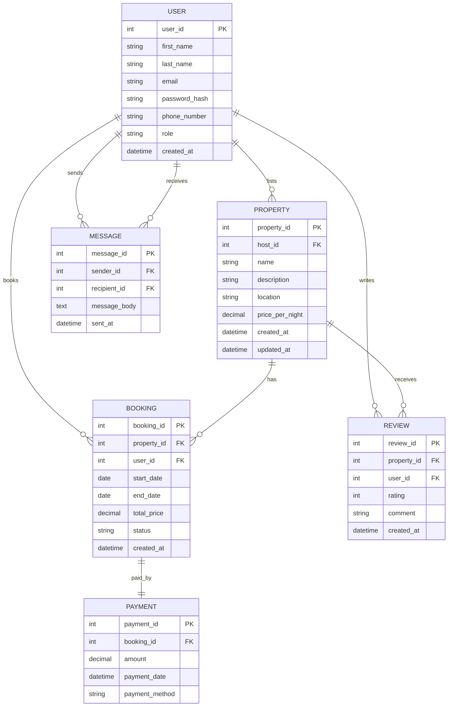

# Entity‑Relationship Diagram (ERD) — Requirements

This document defines the conceptual data model for the Airbnb-clone project. It lists entities, their attributes, relationships and suggested notation for a visual ER diagram (Draw.io / Mermaid / Crow's Foot).

---

## Conventions
- PK = Primary Key  
- FK = Foreign Key  
- Timestamps use snake_case and ISO-like format (created_at, updated_at, sent_at, payment_date).  
- Roles and status fields are enumerations where noted.

---

## Entities and Attributes

### User
- PK: user_id
- first_name
- last_name
- email (unique)
- password_hash
- phone_number
- role (enum: guest, host, admin)
- created_at

### Property
- PK: property_id
- FK: host_id → User.user_id
- name
- description
- location
- price_per_night
- created_at
- updated_at

### Booking
- PK: booking_id
- FK: property_id → Property.property_id
- FK: user_id → User.user_id (guest who made the booking)
- start_date
- end_date
- total_price
- status (enum: pending, confirmed, canceled)
- created_at

### Payment
- PK: payment_id
- FK: booking_id → Booking.booking_id
- amount
- payment_date
- payment_method (enum: credit_card, paypal, stripe)

### Review
- PK: review_id
- FK: property_id → Property.property_id
- FK: user_id → User.user_id (guest who wrote the review)
- rating (integer 1–5)
- comment
- created_at

### Message
- PK: message_id
- FK: sender_id → User.user_id
- FK: recipient_id → User.user_id
- message_body
- sent_at

---

## Relationships (Cardinalities & Notes)

- User 1 — M Property  
  - A host (User) may list many Properties; each Property is listed by exactly one host.
  - Implementation: Property.host_id references User.user_id

- User 1 — M Booking (as guest)  
  - A guest (User) can make many Bookings; each Booking is made by one guest.
  - Implementation: Booking.user_id references User.user_id

- Property 1 — M Booking  
  - A Property can have many Bookings; a Booking is for a single Property.
  - Implementation: Booking.property_id references Property.property_id

- Booking 1 — 1 Payment  
  - Each Booking has exactly one Payment (assumes full payment per booking).
  - Implementation: Payment.booking_id references Booking.booking_id (unique constraint)

- User 1 — M Review (as reviewer)  
  - A User can write many Reviews; each Review is written by one User.
  - Implementation: Review.user_id references User.user_id

- Property 1 — M Review  
  - A Property can have many Reviews; each Review is for one Property.
  - Implementation: Review.property_id references Property.property_id

- User 1 — M Message (as sender)  
  - A User can send many Messages; each Message has one sender.
  - Implementation: Message.sender_id references User.user_id

- User 1 — M Message (as recipient)  
  - A User can receive many Messages; each Message has one recipient.
  - Implementation: Message.recipient_id references User.user_id

Notes:
- Consider adding unique constraints and indexes for frequently queried fields (email, host_id, property_id, booking dates).
- Enforce referential integrity (ON DELETE CASCADE or RESTRICT as appropriate — e.g., prevent deleting a host with existing properties, or archive instead).

---

## Suggested Draw.io / Mermaid Layout

Use Crow's Foot notation in Draw.io; place User at the left, Property and Booking in the middle, and Review/Payment/Message around them.

Example Mermaid ER (can be imported into Mermaid-enabled renderers):

---

## Implementation Tips / Next Steps
- Derive SQL DDL from these entities; ensure appropriate data types and constraints.
- Add migration scripts and seed data for development.
- Consider extension entities: Amenities, Photos, CancellationPolicy, AvailabilityCalendar.
- Decide how to represent multi-day pricing, discounts, taxes and fees (separate tables or columns).

---

